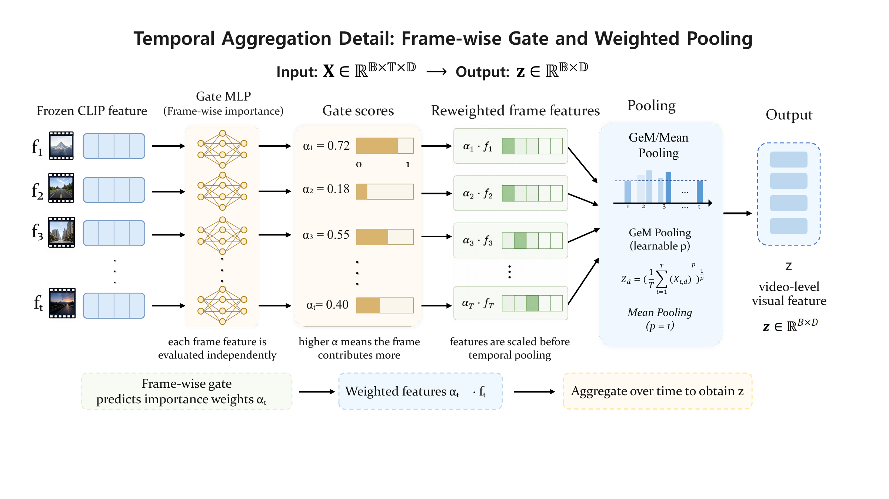

# Parameter-Efficient Vision--Language Adaptation for Driver State Recognition via Frozen Feature Alignment

Frozen Feature Alignment for Driver State Recognition.

This repository contains reproducibility code and paper-facing assets for the proposed frozen-VLM adaptation framework. The main model adapts a frozen CLIP ViT-B/32 backbone to in-cabin driver monitoring with two lightweight trainable components:

- a residual image adapter for driver-domain visual features;
- a prompt-calibration head (PCH) with class-specific prompt weighting, class scale, and class bias.

The main experiments use a single in-cabin RGB stream and evaluate:

- **AIDE**: five-way driver affective-state recognition under the published video-level protocol;
- **YawDD**: binary yawning-based drowsiness-cue detection under a driver-disjoint video-level protocol.

<p align="center">
  
</p>

## What is included

```text
aide_clip/src/                 Training and evaluation entry points
scripts/reproduce/             Paper-oriented commands
scripts/paper_figures/         Figure and diagnostic scripts
paper_assets/                  Lightweight figures used in the paper
docs/                          Dataset layout, protocols, and result tables
tests/                         Minimal adapter sanity tests
```

Large datasets, CLIP weights, feature caches, and checkpoints are intentionally not committed. The scripts write them under local `data/`, `cache/`, `checkpoints/`, and `outputs/` folders.

## Quick start

Create an environment with a CUDA-compatible PyTorch build, then install the remaining dependencies:

```bash
git clone https://github.com/Xigua-Liangdao/FA4DSR.git
cd FA4DSR

python -m venv .venv
source .venv/bin/activate
pip install --upgrade pip

# Install torch separately if your CUDA setup needs a specific wheel.
pip install torch torchvision
pip install -r requirements.txt
```

Run the lightweight sanity test:

```bash
pytest -q
```

## Data layout

The code expects datasets to be placed or symlinked as:

```text
data/
  AIDE_Dataset/
    annotation/
    0001/
      incarframes/
      ...
  yawdd/
    Mirror/
    Dash/
    ...
```

You can also point the scripts to another location:

```bash
export AIDE_ROOT=/path/to/AIDE_Dataset
export AIDE_ANNOTATION_ROOT=/path/to/AIDE_Dataset/annotation
export YAWDD_ROOT=/path/to/yawdd
```

See [docs/DATASETS.md](docs/DATASETS.md) for the exact assumptions.

## Reproducing the main runs

AIDE main model:

```bash
bash scripts/reproduce/run_aide_main.sh
```

YawDD frozen CLIP + Adapter + PCH:

```bash
bash scripts/reproduce/run_yawdd_main.sh
```

YawDD Table III CLIP baselines:

```bash
bash scripts/reproduce/run_yawdd_table3_baselines.sh
```

YawDD visual-backbone trainability analysis:

```bash
bash scripts/reproduce/run_yawdd_backbone_finetune.sh
```

Each script is written with environment variables rather than machine-specific paths. For example:

```bash
DEVICE=cuda:0 SEED=42 bash scripts/reproduce/run_yawdd_main.sh
```

## Reference results

The paper-facing main model is **Frozen CLIP + Adapter + PCH**. Exact local executions may vary with the dataset copy, CLIP cache, GPU stack, and deterministic behavior of the local PyTorch/CUDA installation.

| Task | Model | Protocol | Main metrics |
|---|---|---|---|
| AIDE five-way driver affective-state recognition | Frozen CLIP + Adapter + PCH | single in-cabin RGB, `T=3` uniform frames | Acc 82.50, WF1 81.40, Macro-F1 73.57 |
| YawDD binary yawning-based drowsiness-cue detection | Frozen CLIP + Adapter + PCH | driver-disjoint, `T=10` difference-guided frames | Best Acc 0.839, Best W-F1 0.840, Y-F1 0.711 ± 0.058 |

For table-ready values and row naming, see [docs/RESULTS.md](docs/RESULTS.md).

## Figures

The latest method figures are stored as PDF assets under [paper_assets/](paper_assets/) with PNG previews for GitHub rendering.

<p align="center">
  
</p>

<p align="center">
  
</p>

<p align="center">
  
</p>

PDF sources: [framework overview](paper_assets/fig_arch.pdf), [PCH detail](paper_assets/fig_pch_detail.pdf), and [temporal detail](paper_assets/fig_temporal_detail.pdf).

CGP-FG corresponds to the cross-frame gating path; TAGA corresponds to the temporal-attention path; GeM/mean pooling denotes the pooling family. Paper tables report the canonical names mean pooling, cross-frame gating, and temporal attention.

## Notes for reviewers

- The CLIP image and text encoders are frozen in the main model.
- PCH prompt weighting, class scale, and class bias are enabled in the main model.
- AIDE uses `T=3` uniform frames.
- YawDD uses `T=10` difference-guided frames.
- YawDD is treated as a yawning-based drowsiness-related vigilance-cue benchmark, not as a full physiological drowsiness-label dataset.
- No datasets, pretrained weights, feature caches, or checkpoints are redistributed.

## Citation

If you use this code, please cite the associated paper. A `CITATION.cff` stub is included and can be updated after the final bibliographic metadata is available.
