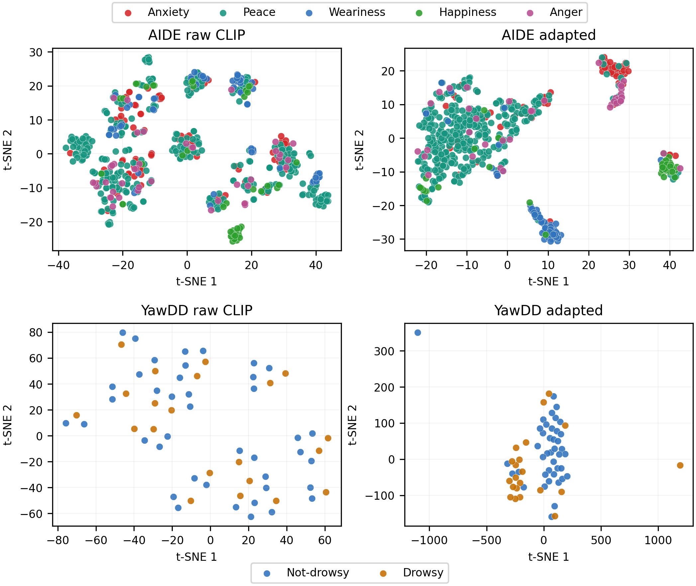
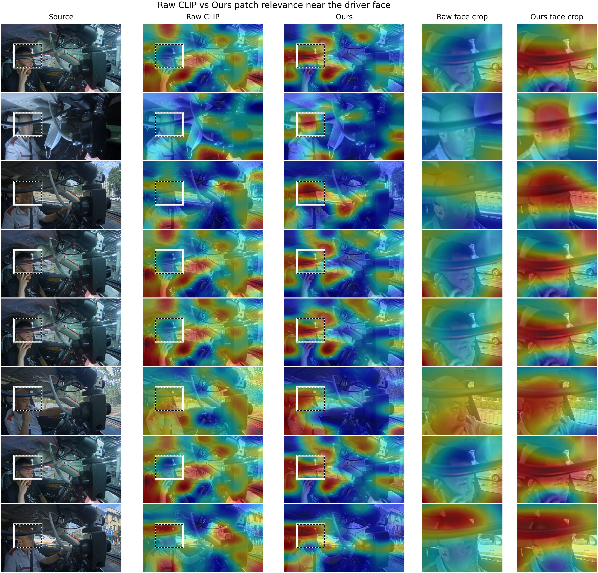

# PACER: Parameter-Efficient CLIP Adaptation for Driver State Recognition

This repository contains the reproducibility code for:

**Parameter-Efficient Vision--Language Adaptation for Driver State Recognition via Frozen Feature Alignment**

PACER adapts a frozen CLIP ViT-B/32 backbone to in-cabin driver monitoring with two lightweight trainable components:

- a residual image adapter for driver-domain visual features;
- a prompt-calibration head (PCH) with class-specific prompt weighting, class scale, and class bias.

The main experiments use a single in-cabin RGB stream and evaluate:

- **AIDE**: five-way driver emotion recognition;
- **YawDD**: binary drowsiness detection under a speaker-independent, video-level protocol.

<p align="center">
  
</p>

## What is included

```text
aide_clip/src/                 Training and evaluation entry points
scripts/reproduce/             Paper-oriented commands
scripts/paper_figures/         Figure and diagnostic scripts
paper_assets/                  Lightweight figures used in the paper
docs/                          Dataset layout, protocols, and result tables
tests/                         Minimal adapter sanity tests
```

Large datasets, CLIP weights, feature caches, and checkpoints are intentionally not committed. The scripts write them under local `data/`, `cache/`, `checkpoints/`, and `outputs/` folders.

## Quick start

Create an environment with a CUDA-compatible PyTorch build, then install the remaining dependencies:

```bash
git clone https://github.com/Xigua-Liangdao/pacer_v2.git
cd pacer_v2

python -m venv .venv
source .venv/bin/activate
pip install --upgrade pip

# Install torch separately if your CUDA setup needs a specific wheel.
pip install torch torchvision
pip install -r requirements.txt
```

Run the lightweight sanity test:

```bash
pytest -q
```

## Data layout

The code expects datasets to be placed or symlinked as:

```text
data/
  AIDE_Dataset/
    annotation/
    0001/
      incarframes/
      ...
  yawdd/
    Mirror/
    Dash/
    ...
```

You can also point the scripts to another location:

```bash
export AIDE_ROOT=/path/to/AIDE_Dataset
export AIDE_ANNOTATION_ROOT=/path/to/AIDE_Dataset/annotation
export YAWDD_ROOT=/path/to/yawdd
```

See [docs/DATASETS.md](docs/DATASETS.md) for the exact assumptions.

## Reproducing the main runs

AIDE main model:

```bash
bash scripts/reproduce/run_aide_main.sh
```

YawDD frozen CLIP + Adapter + PCH:

```bash
bash scripts/reproduce/run_yawdd_main.sh
```

YawDD Table III CLIP baselines:

```bash
bash scripts/reproduce/run_yawdd_table3_baselines.sh
```

YawDD visual-backbone trainability analysis:

```bash
bash scripts/reproduce/run_yawdd_backbone_finetune.sh
```

Each script is written with environment variables rather than machine-specific paths. For example:

```bash
DEVICE=cuda:0 SEED=42 bash scripts/reproduce/run_yawdd_main.sh
```

## Reference results

The paper reports multi-seed results. Exact values depend on the dataset copy, CLIP cache, GPU stack, and deterministic behavior of the local PyTorch/CUDA installation.

| Task | Model | Seeds | Main metric |
|---|---|---:|---:|
| AIDE emotion recognition | Frozen CLIP + Adapter + PCH | 9 | WF1 0.784 ± 0.013 |
| YawDD drowsiness detection | Frozen CLIP + Adapter + PCH | 5 | WF1 0.801 ± 0.039 |
| YawDD partial visual fine-tuning | last 2 ViT blocks + Adapter + PCH | 3 | WF1 0.874 ± 0.054 |

For table-ready values and row naming, see [docs/RESULTS.md](docs/RESULTS.md).

## Figures

<p align="center">
  
</p>

<p align="center">
  
</p>

<p align="center">
  
</p>

Figure scripts live under `scripts/paper_figures/`. The patch-relevance visualisation is a CLIP patch-token diagnostic, not a supervised Grad-CAM comparison.

## Notes for reviewers

- The CLIP image and text encoders are frozen in the main model.
- PCH prompt weight, class scale, and class bias are enabled by default in the main experiments.
- YawDD uses a speaker-independent video-level split and a difference-guided frame sampler.
- The ResNet-50 sanity experiment discussed during development is not part of the main comparison table.
- No dataset files or pretrained checkpoints are redistributed in this repository.

## Citation

If you use this code, please cite the associated paper. A `CITATION.cff` stub is included and can be updated after the final bibliographic metadata is available.
