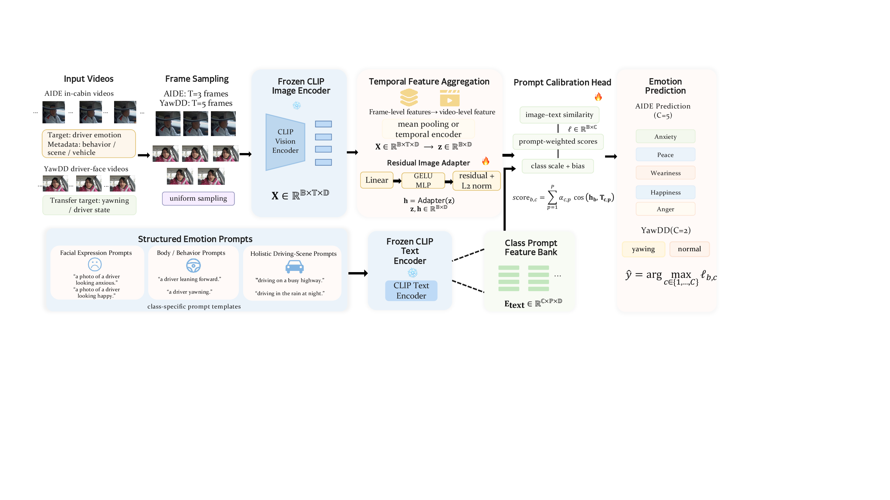
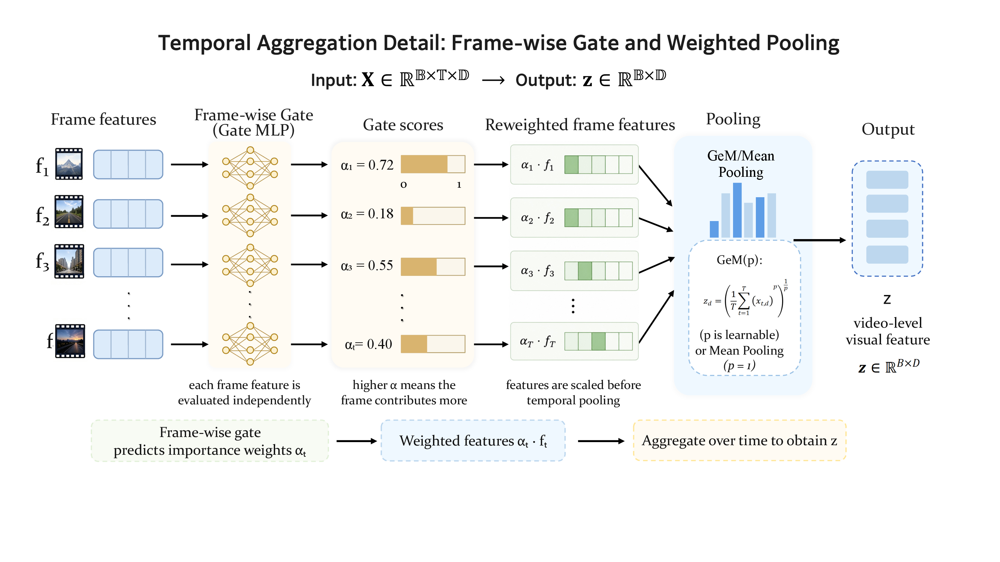
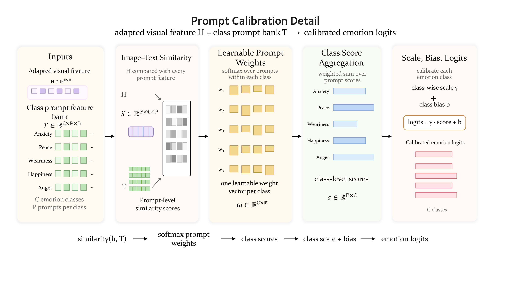

# Frozen Feature Alignment for Driver State Recognition

This repository contains the reproducibility code for the paper:

**Parameter-Efficient Vision--Language Adaptation for Driver State Recognition via Frozen Feature Alignment**

The code implements a frozen CLIP adaptation framework for in-cabin driver monitoring. The main model keeps both CLIP encoders frozen and trains only two lightweight components:

- a residual image adapter that corrects pooled in-cabin visual features;
- a prompt-calibration head (PCH) with class-specific prompt weighting, class scale, and class bias.

The experiments use a single RGB camera stream and evaluate:

- **AIDE**: five-way driver emotion recognition;
- **YawDD**: binary drowsiness detection under a speaker-independent, video-level protocol.

<p align="center">
  
</p>

## What is included

```text
aide_clip/src/                 Training and evaluation entry points
scripts/reproduce/             Paper-oriented commands
scripts/paper_figures/         Figure and diagnostic scripts
paper_assets/                  Lightweight figures used in the paper
docs/                          Dataset layout, protocols, and result tables
tests/                         Minimal adapter sanity tests
```

Large datasets, CLIP weights, feature caches, and checkpoints are intentionally not committed. The scripts write local artifacts under `data/`, `cache/`, `checkpoints/`, and `outputs/`.

## Quick start

Create an environment with a CUDA-compatible PyTorch build, then install the remaining dependencies:

```bash
git clone https://github.com/Xigua-Liangdao/Feature_Alignment_for_Driver_State_Recognition.git frozen-feature-alignment-driver-state
cd frozen-feature-alignment-driver-state

python -m venv .venv
source .venv/bin/activate
pip install --upgrade pip

# Install torch separately if your CUDA setup needs a specific wheel.
pip install torch torchvision
pip install -r requirements.txt
```

Run the lightweight sanity test:

```bash
bash scripts/reproduce/smoke_test.sh
```

If `pytest` is installed, the script runs the included tests. Otherwise it falls back to a small adapter identity check so the repository can still be smoke-tested in a minimal environment.

## Data layout

The code expects datasets to be placed or symlinked as:

```text
data/
  AIDE_Dataset/
    annotation/
    0001/
      incarframes/
      ...
  yawdd/
    Mirror/
    Dash/
    ...
```

You can also point the scripts to another location:

```bash
export AIDE_ROOT=/path/to/AIDE_Dataset
export AIDE_ANNOTATION_ROOT=/path/to/AIDE_Dataset/annotation
export YAWDD_ROOT=/path/to/yawdd
```

See [docs/DATASETS.md](docs/DATASETS.md) for the exact assumptions.

## Reproducing the main runs

AIDE main model:

```bash
bash scripts/reproduce/run_aide_main.sh
```

YawDD frozen CLIP + Adapter + PCH:

```bash
bash scripts/reproduce/run_yawdd_main.sh
```

YawDD Table III CLIP baselines:

```bash
bash scripts/reproduce/run_yawdd_table3_baselines.sh
```

YawDD visual-backbone trainability analysis:

```bash
bash scripts/reproduce/run_yawdd_backbone_finetune.sh
```

Each script is written with environment variables rather than machine-specific paths. For example:

```bash
DEVICE=cuda:0 SEED=42 bash scripts/reproduce/run_yawdd_main.sh
```

## Reference results

The paper reports multi-seed results. Exact values can vary slightly with the dataset copy, CLIP cache, GPU stack, and deterministic behavior of the local PyTorch/CUDA installation.

| Task | Model | Seeds | Main metric |
|---|---|---:|---:|
| AIDE emotion recognition | Frozen CLIP + Adapter + PCH | 9 | WF1 0.784 ± 0.013 |
| YawDD drowsiness detection | Frozen CLIP + Adapter + PCH | 5 | WF1 0.801 ± 0.039 |
| YawDD partial visual fine-tuning | last 2 ViT blocks + Adapter + PCH | 3 | WF1 0.874 ± 0.054 |

For table-ready values and row naming, see [docs/RESULTS.md](docs/RESULTS.md).

## Figures

The diagrams below are rendered from the supplied paper presentation deck after converting it to PDF. The README therefore uses the same visual material as the manuscript deck rather than regenerated placeholder art. The source PDF is kept at `paper_assets/source_paper_deck.pdf`.

<p align="center">
  
</p>

<p align="center">
  
</p>

Figure and diagnostic scripts live under `scripts/paper_figures/`; generated analysis plots are not displayed here unless they correspond directly to manuscript figures.

## Notes for reviewers

- The CLIP image and text encoders are frozen in the main model.
- PCH prompt weight, class scale, and class bias are enabled by default in the main experiments.
- YawDD uses a speaker-independent video-level split and a difference-guided frame sampler.
- The ResNet-50 sanity experiment discussed during development is not part of the main comparison table.
- No dataset files or pretrained checkpoints are redistributed in this repository.

## Citation

If you use this code, please cite the associated paper. A `CITATION.cff` stub is included and can be updated after the final bibliographic metadata is available.
